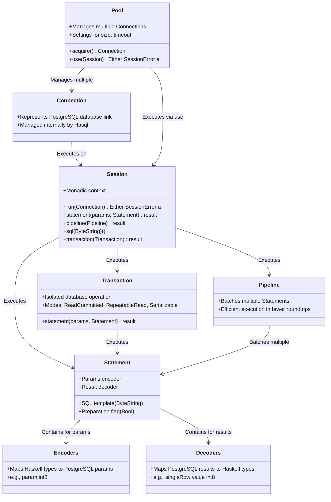

```mermaid
classDiagram
    class Pool {
        +Manages multiple Connections
        +Settings for size, timeout
        +acquire() Connection
        +use(Session) Either SessionError a
    }

    class Connection {
        +Represents PostgreSQL database link
        +Managed internally by Hasql
    }

    class Session {
        +Monadic context
        +run(Connection) Either SessionError a
        +statement(params, Statement) result
        +pipeline(Pipeline) result
        +sql(ByteString) ()
        +transaction(Transaction) result
    }

    class Transaction {
        +Isolated database operation
        +Modes: ReadCommitted, RepeatableRead, Serializable
        +statement(params, Statement) result
    }

    class Pipeline {
        +Batches multiple Statements
        +Efficient execution in fewer roundtrips
    }

    class Statement {
        +SQL template (ByteString)
        +Params encoder
        +Result decoder
        +Preparation flag (Bool)
    }

    class Encoders {
        +Maps Haskell types to PostgreSQL params
        +e.g., param int8
    }

    class Decoders {
        +Maps PostgreSQL results to Haskell types
        +e.g., singleRow value int8
    }

    Pool --> Connection : Manages multiple
    Connection --> Session : Executes on
    Pool --> Session : Executes via use
    Session --> Transaction : Executes
    Session --> Statement : Executes
    Session --> Pipeline : Executes
    Transaction --> Statement : Executes
    Pipeline --> Statement : Batches multiple
    Statement --> Encoders : Contains for params
    Statement --> Decoders : Contains for results
```