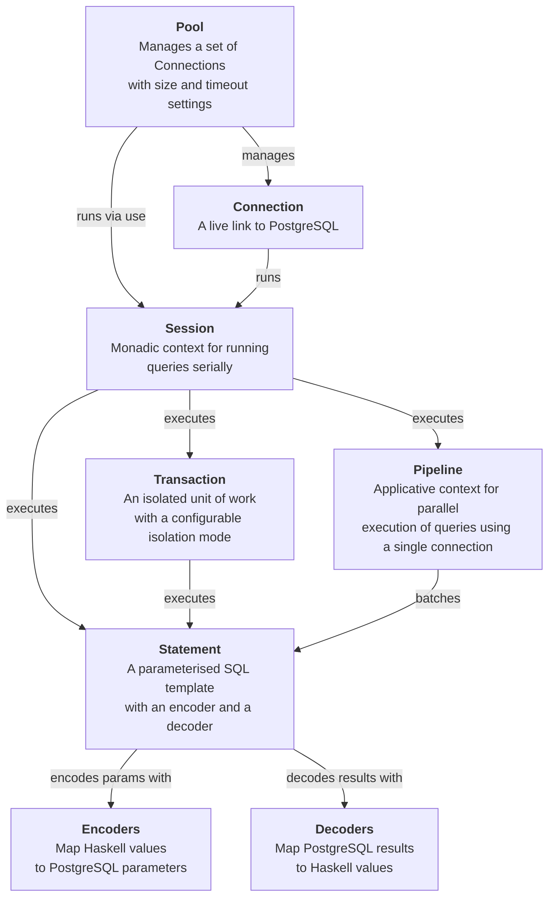

```mermaid
flowchart TD
    Pool["<b>Pool</b><br/>Manages a set of Connections<br/>with size and timeout settings"]
    Connection["<b>Connection</b><br/>A live link to PostgreSQL"]
    Session["<b>Session</b><br/>Monadic context for running<br/>queries serially"]
    Transaction["<b>Transaction</b><br/>An isolated unit of work<br/>with a configurable isolation mode"]
    Pipeline["<b>Pipeline</b><br/>Applicative context for parallel<br/>execution of queries using a single connection"]
    Statement["<b>Statement</b><br/>A parameterised SQL template<br/>with an encoder and a decoder"]
    Encoders["<b>Encoders</b><br/>Map Haskell values<br/>to PostgreSQL parameters"]
    Decoders["<b>Decoders</b><br/>Map PostgreSQL results<br/>to Haskell values"]

    Pool -->|manages| Connection
    Pool -->|runs via use| Session
    Connection -->|runs| Session
    Session -->|executes| Transaction
    Session -->|executes| Statement
    Session -->|executes| Pipeline
    Transaction -->|executes| Statement
    Pipeline -->|batches| Statement
    Statement -->|encodes params with| Encoders
    Statement -->|decodes results with| Decoders
```